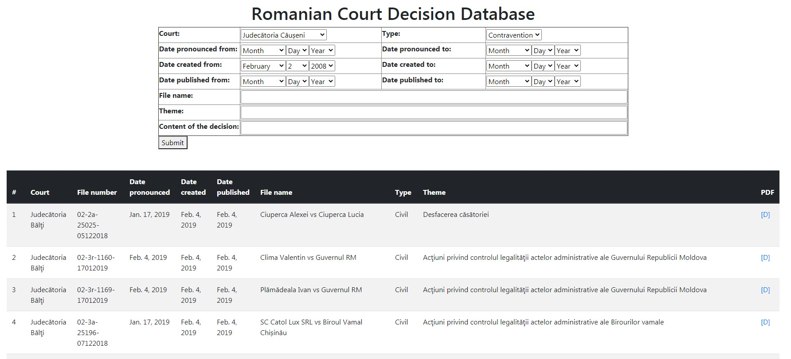

# RCourt
Scrape decisions of Romanian Courts, save them in the DB. Show the results in web interface, that enables a full text 
search of the decisions.

Webscraping is done by custom django-admin commands:

court_import
- import courts and their web adresses from a text-file

decision_import
- based on the textfile, scrape the websites of the courts to get the decisions.

### packages needed:
Django

bs4

psycopg2

-- PostgreSQL is needed for the full-text search.

